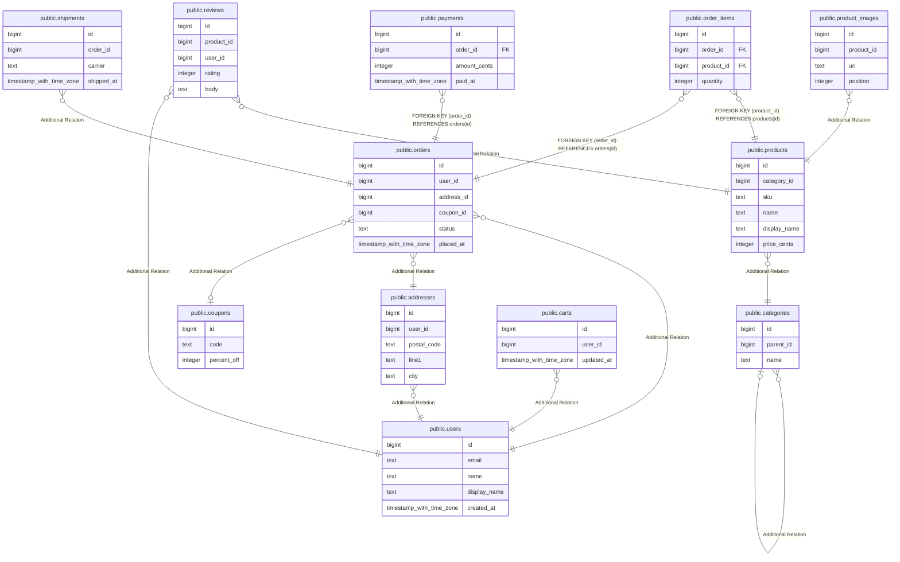

# ER diagram

```mermaid
erDiagram

"public.order_items" }o--|| "public.products" : "FOREIGN KEY (product_id) REFERENCES products(id)"
"public.order_items" }o--|| "public.orders" : "FOREIGN KEY (order_id) REFERENCES orders(id)"
"public.payments" }o--|| "public.orders" : "FOREIGN KEY (order_id) REFERENCES orders(id)"
"public.addresses" }o--|| "public.users" : "Additional Relation"
"public.categories" }o--o| "public.categories" : "Additional Relation"
"public.products" }o--|| "public.categories" : "Additional Relation"
"public.product_images" }o--|| "public.products" : "Additional Relation"
"public.orders" }o--|| "public.users" : "Additional Relation"
"public.orders" }o--|| "public.addresses" : "Additional Relation"
"public.orders" }o--o| "public.coupons" : "Additional Relation"
"public.shipments" }o--|| "public.orders" : "Additional Relation"
"public.reviews" }o--|| "public.products" : "Additional Relation"
"public.reviews" }o--|| "public.users" : "Additional Relation"
"public.carts" }o--|| "public.users" : "Additional Relation"

"public.users" {
  bigint id
  text email
  text name
  text display_name
  timestamp_with_time_zone created_at
}
"public.addresses" {
  bigint id
  bigint user_id
  text postal_code
  text line1
  text city
}
"public.categories" {
  bigint id
  bigint parent_id
  text name
}
"public.products" {
  bigint id
  bigint category_id
  text sku
  text name
  text display_name
  integer price_cents
}
"public.product_images" {
  bigint id
  bigint product_id
  text url
  integer position
}
"public.coupons" {
  bigint id
  text code
  integer percent_off
}
"public.orders" {
  bigint id
  bigint user_id
  bigint address_id
  bigint coupon_id
  text status
  timestamp_with_time_zone placed_at
}
"public.order_items" {
  bigint id
  bigint order_id FK
  bigint product_id FK
  integer quantity
}
"public.payments" {
  bigint id
  bigint order_id FK
  integer amount_cents
  timestamp_with_time_zone paid_at
}
"public.shipments" {
  bigint id
  bigint order_id
  text carrier
  timestamp_with_time_zone shipped_at
}
"public.reviews" {
  bigint id
  bigint product_id
  bigint user_id
  integer rating
  text body
}
"public.carts" {
  bigint id
  bigint user_id
  timestamp_with_time_zone updated_at
}
```
